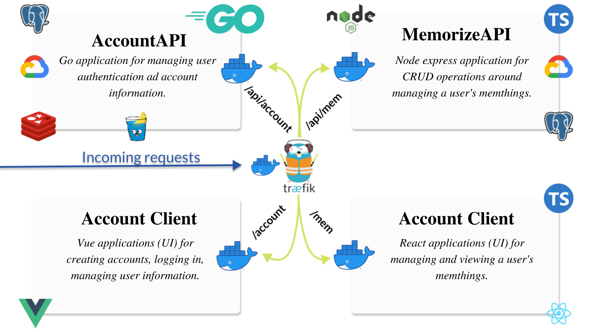
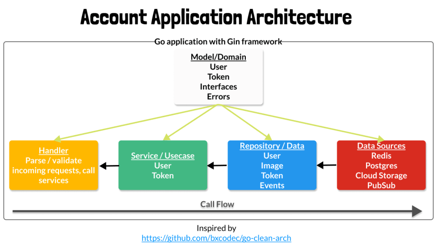

# Vjetmemorize

A chart of the tools and applications used is given below.

To run this code, you will need docker and docker-compose installed on your machine. In the project root, run `docker-compose up`.

## Application Architecture

A summary of the architecture is depicted below [go_clean_arch](https://viblo.asia/p/clean-architecture-Ljy5VMYzlra).

